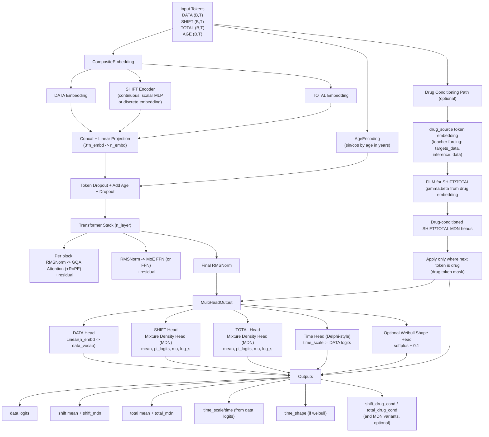

# Composite Delphi: Disease & Drug Prediction Model

This project extends the original Delphi generative model to support **Precision Drug Dosing**.
While the original Delphi predicts the natural history of diseases, **Composite Delphi** simultaneously predicts:
1.  **Next Disease Risk** (Disease Forecasting)
2.  **Drug Dose Change (SHIFT)**: Classification of whether to Decrease, Maintain, or Increase dosage.
3.  **Total Dosage Amount (TOTAL)**: Regression of the total drug quantity.

## Key Features

### 1. Composite Prediction Heads
The model uses a multi-task learning approach with specialized heads:
-   **Data Head**: Predicts the next disease token (standard Delphi).
-   **Shift Head**: Predicts drug dose modification (`0`: Pad, `1`: Decrease, `2`: Maintain, `3`: Increase).
-   **Total Head**: Predicts the exact total dosage amount using a regression objective.

### 2. FiLM (Feature-wise Linear Modulation)
To simulate **drug interventions**, we use FiLM layers.
-   The model can condition its predictions on a specific drug (e.g., Metformin).
-   The drug embedding modulates the internal representations of the Transformer via affine transformations ($\gamma x + \beta$).
-   This allows for counterfactual analysis: *"What happens to the patient's risk if we prescribe Drug X versus Drug Y?"*

### 3. Mixture of Experts (MoE)
-   Utilizes a Sparse MoE architecture to scale up model capacity while maintaining inference efficiency.
-   Efficiently handles large-scale heterogeneity in patient data.

---

## Installation

Ensure you have Python 3.8+ and PyTorch installed.

```bash
pip install torch numpy pandas scikit-learn tqdm
```

---

## Usage

### 1. Training

To train the Composite Delphi model:

```bash
python -m train_model
```

**Key Configuration (`train_model.py`):**
-   `apply_token_shift = False`: Ensures padding is `0` (Ignore) to prevent noise.
-   `shift_loss_type = 'focal'`: Handles class imbalance in SHIFT predictions.
-   `loss_weight_total = 100.0`: Scales MSE loss for TOTAL regression stability.

### 2. Evaluation

To evaluate the trained model on validation or test sets:

```bash
python -m evaluate_auc --model_ckpt_path out/ckpt.pt --model_type composite
```

**Output Explanation:**
-   **Confusion Matrix**: Shows raw classes (Row: Actual, Col: Predicted).
    -   `1`: Decrease
    -   `2`: Maintain
    -   `3`: Increase
    -   *Note: Class `0` (Padding) is excluded from metrics.*
-   **AUC Statistics**: Mean/Median AUC for disease prediction.
-   **Drug-Conditioned Metrics**: Sensitivity/F1 specifically for drug-related tokens.

---

## Technical Details

-   **Architecture**: Transformer Decoder (GPT-style) with MoE layers.
-   **Class Balancing**:
    -   Uses `WeightedRandomSampler` to ensure rare events (Decrease/Increase) are seen during training.
    -   Uses **Focal Loss** ($\gamma=2.0$) to focus learning on hard misclassified examples.
-   **Data Handling**:
    -   Composite data format: `(ID, AGE, DATA, SHIFT, TOTAL)`
    -   Evaluation supports internal splits (KR Val/Test) and external validation sets (JMDC, UKB).

# Model v6 Architecture (CompositeDelphi, Delphi-style)



## Notes
- v6 is **Delphi-style for time**: event type/time coupling uses `data logits` as time scale logits (`time_scale` alias).
- SHIFT/TOTAL are continuous-regression heads via MDN; point estimates use mixture mean.
- Drug conditioning uses FiLM modulation and is applied only at drug-target positions.
